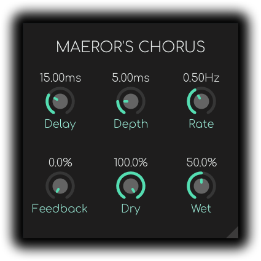
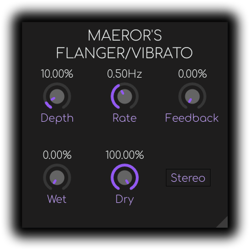
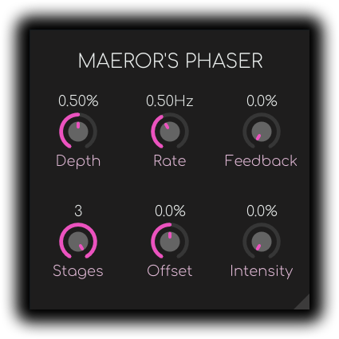
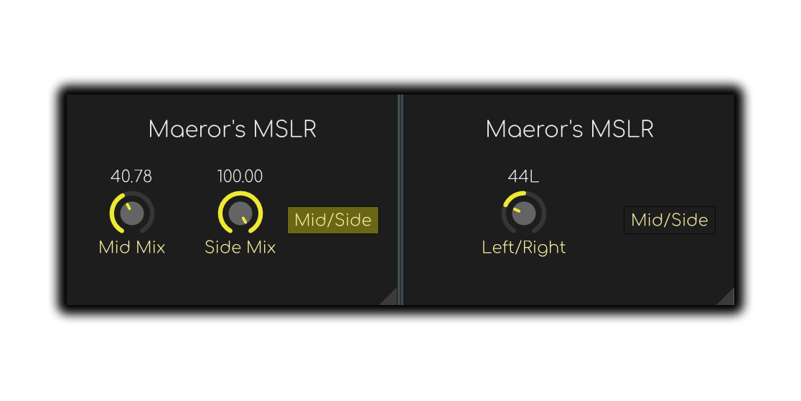
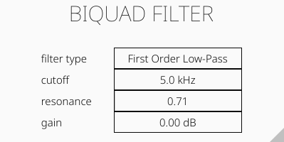

<p align=”center”>
    
</p>

In this repository you can find all of my VST3 plugins written in Rust using the [nih-plug](https://github.com/robbert-vdh/nih-plug) framework and the [Vizia](https://github.com/vizia/vizia) UI library.

### Additional Credits
Most plugins (all in the future) are using modified `KnobParam` implementations from [this repository](https://github.com/danferns/simple-panner/blob/main/src/editor/param_knob.rs) by [Daniel Fernandes](https://github.com/danferns)

## Building
After installing [Rust](https://rustup.rs/), you can compile the plugins as follows:

```shell
cd [plugin-directory-name]
cargo xtask bundle [plugin-name] --release
```
Current plugin names are as follows:
- biquad_filter
- chorus
- flanger
- disperser
- phaser

If i forget to update this file, the plugin name can be found in the `bundler.toml` file in each of the folders.

Build files will be in the `target/bundled/[plugin-name.vst3]` folder. You can then find the proper version of .vst3 file there and copy it to your VST3 plugin folder.

On Windows the vst3 plugin folder is usually `C:\Program Files\Common Files\VST3` or `C:\Program Files (x86)\Common Files\VST3`.

## Descriptions

### Chorus
Simple chorus plugin that adds 3 voices (technically 6, because it's stereo) to the input signal using interpolated delay lines.

<p align="center" width="100%">
    
</p>

### Flanger
Flanger/Vibrato plugin using interpolated delay lines. To achieve vibrato effect set the feedback to 0%, wet to 100% and dry to 0%.

<p align="center" width="100%">
    
</p>

### Phaser
3-stage stereo phaser plugin using first order allpass filters.

<p align="center" width="100%">
    
</p>

### Phase Disperser
Multiple Allpass filters in series create a phase dispersion effect. A very simplified description is that through phase shifting it delays lower frequencies creating the unique liquid-ish sounding effect.

### MSLR (Mid Side Left Right)
This effect has two functions:
- adjusting volume of mid and side channels of a signal
- simple panning of a signal

Mid/side encoding is done using the following formulas:
```
mid = (left + right) * 0.5;
l_side = (left - right) * 0.5;
r_side = (right - left) * 0.5;
```

<p align="center" width="100%">
    
</p>

### Biquad Filter
A simple biquad filter with a first and second order lowpass, highpass and allpass, and bandpass, notch, low/high shelf and a peak options.

<p align="center" width="100%">
    
</p>

## Note
These plugins are not production-ready. They are written as a side-project to learn how DSP effects work. I test my plugins myself and there is always a chance that with certain parameter combinations the plugin will start outputting constant DC signal or very loud signal, because of an infinite feedback loop or simply a mistake in the code. If such a thing happens, open an issue and describe the problem and parameter values that cause problems.

## License
Copyright (C) 2023  Hubert Łabuda

This program is free software: you can redistribute it and/or modify
it under the terms of the GNU General Public License as published by
the Free Software Foundation, either version 3 of the License, or
(at your option) any later version.

This program is distributed in the hope that it will be useful,
but WITHOUT ANY WARRANTY; without even the implied warranty of
MERCHANTABILITY or FITNESS FOR A PARTICULAR PURPOSE.  See the
GNU General Public License for more details.

You should have received a copy of the GNU General Public License
along with this program.  If not, see <https://www.gnu.org/licenses/>.