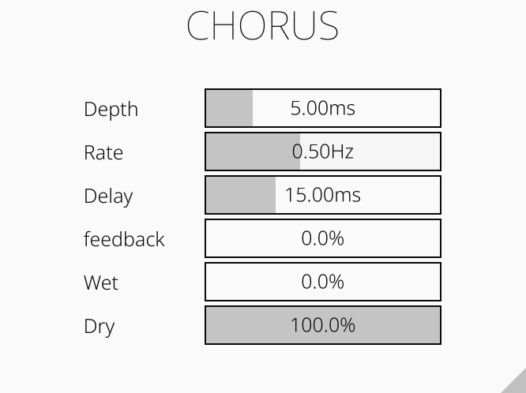
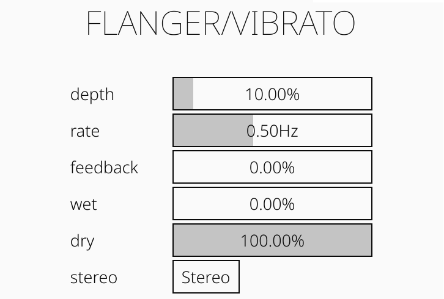
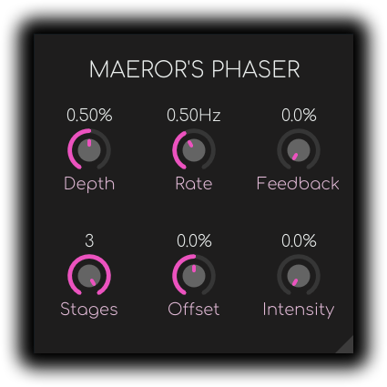

# All my VST3 plugins.

In this repository you can find all of my VST3 plugins written in Rust using the nih-plug framework.

## Building
After installing [Rust](https://rustup.rs/), you can compile the plugins as follows:

```shell
cd [plugin-directory-name]
cargo xtask bundle [plugin-name] --release
```
Current plugin names are as follows:
- biquad_filter
- chorus
- flanger
- disperser
- phaser

If i forget to update this file, the plugin name can be found in the `bundler.toml` file in each of the folders.

Build files will be in the `target/bundled/[plugin-name.vs3]` folder. You can then find the proper version of .vst3 file there and copy it to your VST3 plugin folder.

On Windows the vst3 plugin folder is usually `C:\Program Files\Common Files\VST3` or `C:\Program Files (x86)\Common Files\VST3`.

## Descriptions

### Biquad Filter
A simple biquad filter with a first and second order lowpass, highpass and allpass, and bandpass, notch, low/high shelf and a peak options.


### Chorus
Simple chorus plugin that adds 3 voices to the input signal.



### Flanger
Flanger/Vibrato plugin. To achieve  vibrato effect set the feedback to 0%, wet to 100% and dry to 0%.



### Phaser
3-stage stereo phaser plugin.



### Phase Disperser
Multiple Allpass filters in series create a phase dispersion effect. A very simplified description is that through phase shifting it delays lower frequencies creating the unique "disperser" sound.

## License
The MIT License (MIT)

Copyright (c) 2023 Hubert Łabuda

Permission is hereby granted, free of charge, to any person obtaining a copy of this software and associated documentation files (the “Software”), to deal in the Software without restriction, including without limitation the rights to use, copy, modify, merge, publish, distribute, sublicense, and/or sell copies of the Software, and to permit persons to whom the Software is furnished to do so, subject to the following conditions:

The above copyright notice and this permission notice shall be included in all copies or substantial portions of the Software.

THE SOFTWARE IS PROVIDED “AS IS”, WITHOUT WARRANTY OF ANY KIND, EXPRESS OR IMPLIED, INCLUDING BUT NOT LIMITED TO THE WARRANTIES OF MERCHANTABILITY, FITNESS FOR A PARTICULAR PURPOSE AND NONINFRINGEMENT. IN NO EVENT SHALL THE AUTHORS OR COPYRIGHT HOLDERS BE LIABLE FOR ANY CLAIM, DAMAGES OR OTHER LIABILITY, WHETHER IN AN ACTION OF CONTRACT, TORT OR OTHERWISE, ARISING FROM, OUT OF OR IN CONNECTION WITH THE SOFTWARE OR THE USE OR OTHER DEALINGS IN THE SOFTWARE.